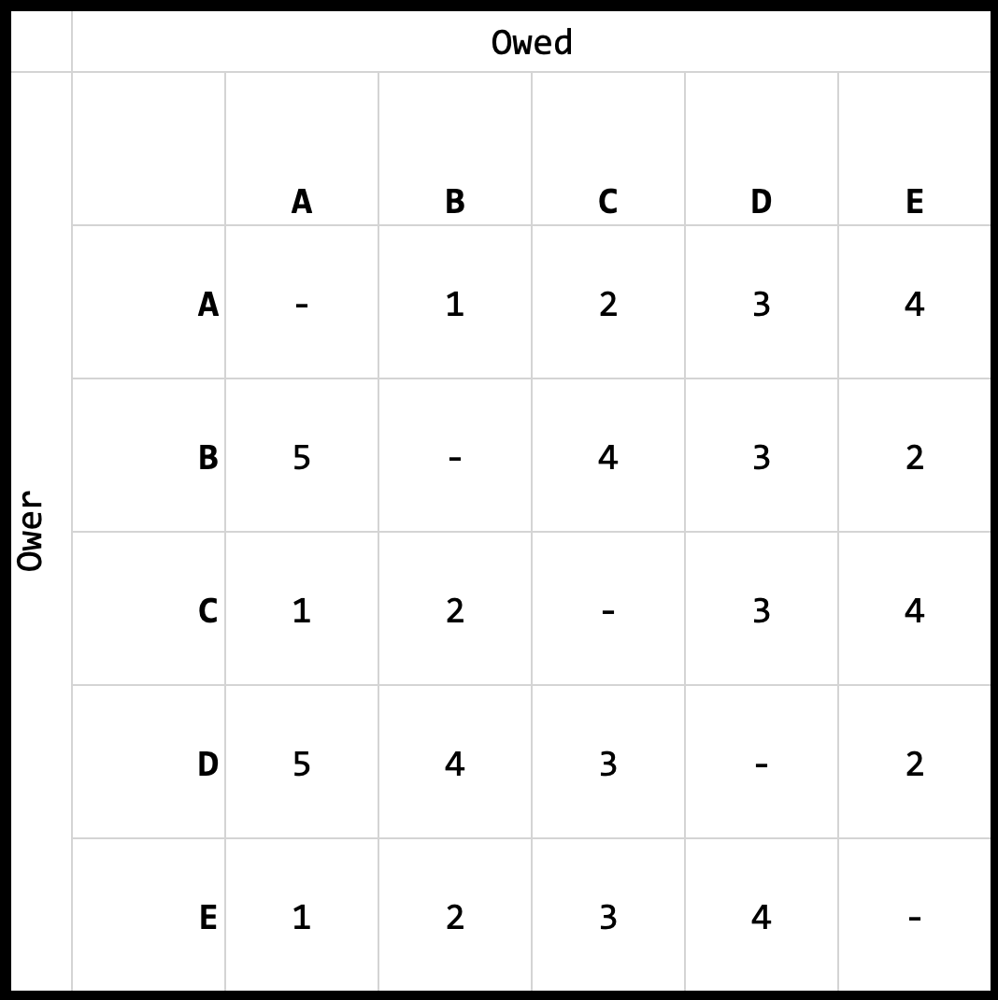
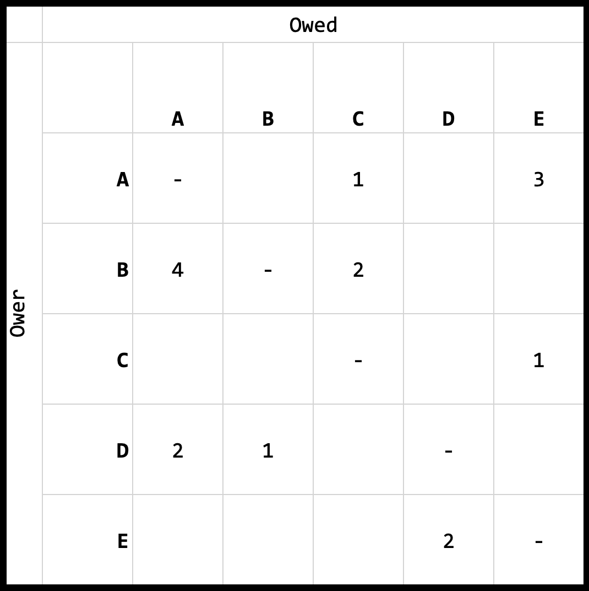

# Split Expense Tracker App

## About
This web app is my first attempt at full-stack development using the MERN stack. 

## Folder structure
```
├── client
│   ├── public
│   └── src
└── server
    ├── db
    ├── routes
    └── server.js
```

- `client`: Front-end (React)
- `server`: Back-end API (Express & MongoDB)

## To do:
1. start writing who-owes-who logic
1. disable export button when error 

## Who-owes-who algorithm
The "who-owes-who algorithm", also known as the debt-settlement algorithm [citation] reduces and simplifies the transactions. The algorithm aims to present the exact amount owers have to pay the owed.

Example:

A group of 5 goes for a trip together. It is often convenient for one person to pay on behalf of others first, then settle the amount with the rest later. With the algorithm, it takes into account every transaction made by each person and for each person, and split the amount owed respectively. 

This algorithm takes 2 approaches to reduce and simplify the transactions.

### Reduction
Reducing transactions will reduce unnecessary back-and-forth transactions.

For example, if A owes B $10, but B owes A $5, then A effectively only owes B $5. This reduces 2 transactions down to 1.

Concrete example:

Assume this debt matrix. Take RowA ColB for example. This cell refers to the amount that A owes B. Or A -> B. This cell represents A->B: 1.



Now see RowB ColA, or B -> A. Since RowB ColA represents the 'converse' of RowA ColB, we can deduce that A->B: 1, but B->A: 5. Since A owes B $1, but B owes A $5, B effectively only owes A $4. If we were to update Cell RowB ColA to 4, we should 'settle' this by updating Cell RowA ColB to 0. 

Intuitively, we can simply do: (RowX ColY) - (RowY ColX) for every transaction, and set negative values to 0. Reducing this debt matrix will result in this: The reduced debt matrix



Pay up! With this reduced matrix, we can effectively say that:

- A owes C $1
- A owes E $3
- B owes A $4
- B owes C $2
- C owes E $1
- D owes A $2
- D owes B $1
- E owes D $2

... but is this optimal?

### Simplified
Imagine a funny scenario where 
- A owes B $5
- B owes C $5
- C owes A $5

It would be pretty silly to actually transact that amount between the 3 friends, because they effectively owe each other nothing! And if you were to draw it out as a directed weighted graph, you realise there's a cycle! 

So what can we do about this to simplify the transactions further such that a minimum number of transactions need to be made? Initially, I drew out the problem as graphs, and tried to eliminate cycles, but I realise I was just overcomplicating things. Let me break it down for you:


Within a contained environment, i.e. the original group of 5, transactions will be made among one another. 